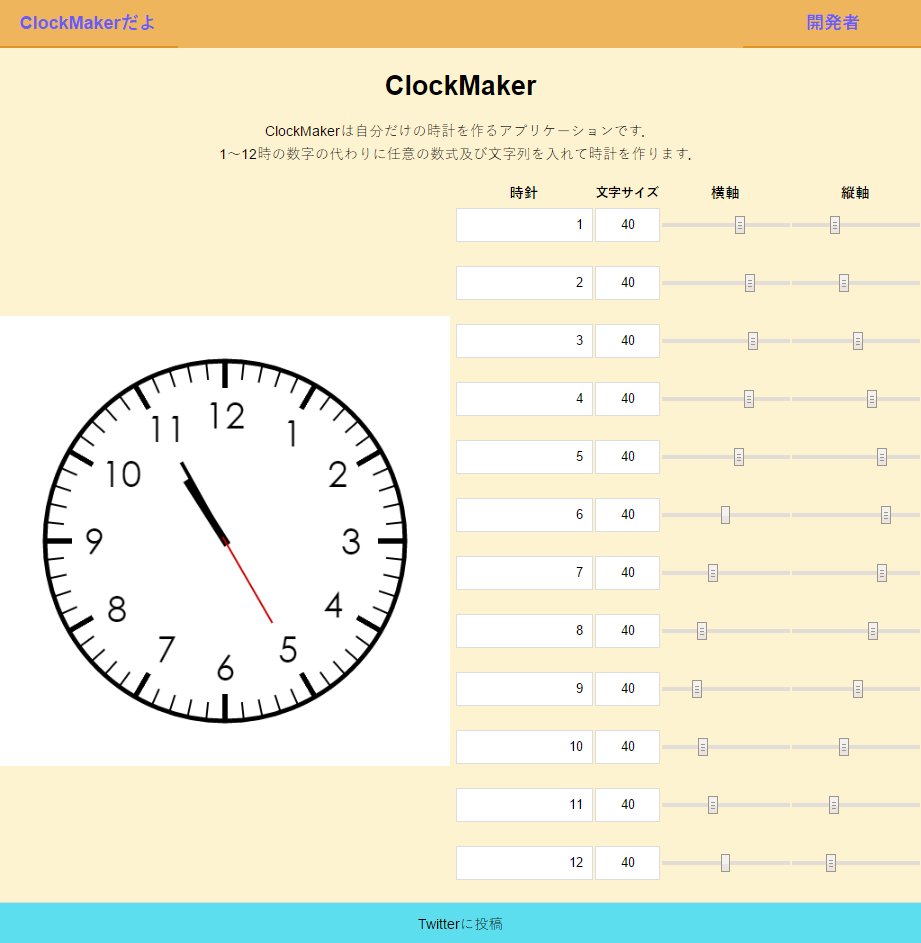

# ClockMaker

## Application



## Usage

```
git clone https://github.com/ferretdayo/ClockMaker.git
cd ClockMaker
composer install
php artisan serve
```

## What is ClockMaker

ClockMakerは自分だけの時計を作るアプリケーションです．<br>

## About Technology

利用しているフレームワーク
- Laravel
- Vue.js (2系じゃないよ)

## License

MIT<br>
ご自由にどうぞ
